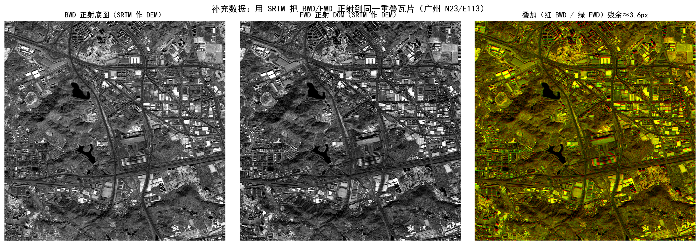

# 补充数据赛道 · 实验报告

> 项目：武汉大学《卫星摄影测量》课程设计 · SatPhoto-Pro 集成软件
> 数据赛道：**补充数据**（`卫星摄影测量-补充数据/`，FWD / BWD 前后视立体像对 + SRTM）
> 说明：本赛道**无老师真值、无现成参考底图**，与测试用例赛道是两条相互独立的数据；本报告只针对补充数据。

---

## 1. 摘要

老师对补充数据的提示是：**该区域没有给底图，可以自己找开源参考底图，也可以把 BWD 影像正射纠正出来当底图用；`n23_e113_1arc_v3`（SRTM）可在正射纠正时当 DEM 用。**

据此本赛道完成：

1. 将 FWD / BWD 的 **RPC00B 文本格式** 转换为课程 `.rpb`，复用测试用例赛道的全部 RPC 流程；
2. **以 SRTM 作 DEM**，对前后视影像的**重叠中心瓦片**做"开窗正射"（规避整幅 2.8 GB 影像入内存），得到带地理参考的 DOM——其中 **BWD 的正射 DOM 即作为"自制参考底图"**；
3. 评估 **BWD 自制底图与 FWD-DOM 的相互配准**（相位相关 + SIFT/RANSAC），量化两幅影像 RPC 的相对一致性——这正是后续控制点匹配（Task2）能否开展的前提。

实测：自制底图与 FWD-DOM 在 6 km 量级瓦片上**残余配准约 3.6–3.9 px（≈8 m）**，**SIFT 经 RANSAC 得 544 个内点**，证明"BWD 正射当底图"这一路线**可行且可支撑控制点匹配**。

---

## 2. 数据说明

| 文件 | 尺寸 / 类型 | 说明 |
|---|---|---|
| `BWD.tif` | 35864 × 40000，uint16 单波段，约 2.87 GB | 后视全色影像（原始传感器影像，无内嵌地理参考） |
| `FWD.tif` | 31268 × 31000，uint16 单波段，约 1.94 GB | 前视全色影像 |
| `BWD_rpc.txt` / `FWD_rpc.txt` | RPC00B 文本 | 字段为 `LINE_OFF / SAMP_OFF / … / LINE_NUM_COEFF_i …`，与课程 `.rpb` 命名不同但 20 项系数顺序一致 |
| `n23_e113_1arc_v3.tif` | 3601 × 3601，int16，EPSG:4326 | SRTM 1 弧秒（≈30 m）DEM，覆盖 113°–114°E、23°–24°N |

由 RPC 可读出：BWD 地面中心约 **(113.496°E, 23.136°N)**、HEIGHT_OFF≈169 m；FWD 约 (113.49°E, 23.13°N)、HEIGHT_OFF≈165 m——即**广州一带**。两幅影像地面足迹大幅重叠，SRTM 完整覆盖该区域，构成可用的"前后视立体 + DEM"组合。

---

## 3. 底图获取策略

老师给出两条路线，本赛道采用**第二条（自制底图）**，理由是完全离线、可复现、且与课程"用 BWD 正射当底图"的提示直接对应：

| 策略 | 做法 | 取舍 |
|---|---|---|
| 联网开源底图 | 下载 Esri/Google 等卫星底图作参考 | 更接近"真实底图"，但需联网、需配准、存在时相差异与坐标对齐风险 |
| **自制底图（本赛道采用）** | **用 SRTM 作 DEM，把 BWD 正射成 DOM 当参考底图** | 完全离线自洽、可复现，正是老师建议；其精度受 SRTM(30 m) 与 RPC 限制，但足以支撑控制点匹配 |

---

## 4. 方法

### 4.1 RPC 文本 → `.rpb`

补充数据的 RPC 为标准 RPC00B 文本，20 项系数顺序与 RPC00B 一致（`1, L, P, H, LP, LH, PH, …, H³`）。`photogrammetry_suite/pipeline/supp_rpc.py` 将其转换为课程 `.rpb`，转换后即可被 Task1/Task3/Task5 的 RPC 模型直接读取。验证：把地面中心点 `(LONG_OFF, LAT_OFF, HEIGHT_OFF)` 正解回像方，结果与 RPC 常数项一致（如 BWD 得 line≈20202 = `LINE_NUM_COEFF_1`×`LINE_SCALE`+`LINE_OFF`），证明解析正确。

### 4.2 开窗正射（SRTM 作 DEM）

整幅影像近 2.9 GB，无法整幅入内存。采用**间接法 + 开窗读取**：

1. 在重叠区中心选瓦片 **lon[113.470, 113.530] × lat[23.100, 23.160]**（≈6.1 km 见方），输出分辨率 **≈2.2 m**（3000 × 3000）；
2. 对每个输出像素中心，从 **SRTM 双线性内插高程**；
3. 用（转换后）RPC 正解得到原始影像坐标 `(line, sample)`；
4. 仅按其包围盒 **window 读取所需影像窗口**，再双线性重采样赋值；
5. 输出 DOM（`.tif + .tfw + .prj`，EPSG:4326）。

BWD / FWD 各得一幅同网格 DOM，**BWD 的 DOM 即自制参考底图**。

### 4.3 相互配准评估

由于无真值，采用**相对/自洽**评估：对同网格的 BWD-DOM 与 FWD-DOM，
(1) 相位相关求亚像素残余平移；(2) SIFT 特征匹配 + RANSAC（仿射）剔粗差，统计内点数与中值平移。

---

## 5. 结果

| 指标 | 数值 |
|---|---|
| 正射瓦片 | lon[113.470, 113.530] × lat[23.100, 23.160]，3000 × 3000，≈2.2 m/px |
| SRTM 高程范围（瓦片内） | −33 ~ 230 m |
| BWD 取窗 | 列[13438, 24304] × 行[15108, 27104] |
| FWD 取窗 | 列[12623, 22260] × 行[11130, 19583] |
| 相位相关残余平移 | **3.56 px（≈7.9 m）** |
| SIFT 关键点 | BWD 4001 / FWD 4001 |
| SIFT 良匹配 / RANSAC 内点 | 705 / **544** |
| 内点中值平移 | **3.88 px（≈8.5 m）** |
| 用时 | ≈45 s |

- 视觉上（见图）：BWD 底图与 FWD-DOM 的道路、桥梁、水体、街区高度吻合；叠加图中绝大部分呈灰/黄（重合），仅见轻微红绿分离（约 3.6 px 的相对错位）。
- 该约 8 m 的相对错位主要来自：**前后视 RPC 的相对系统偏差**、**SRTM 30 m 分辨率与真实地形/建筑的差异**、以及**SRTM 正常高与 RPC 椭球高之间的似大地水准面差**（未做 EGM 改正）。

---

## 6. 无真值下的评估与自洽性结论

补充数据没有老师答案，无法给出绝对精度，故结论基于**几何自洽与相对一致性**：

1. **RPC 解析自洽**：地面中心点正解回像方与 RPC 常数项吻合，证明文本→`.rpb` 转换无误。
2. **正射几何自洽**：BWD、FWD 用各自 RPC + 同一 SRTM 正射到同一地面网格后高度吻合（544 个 RANSAC 内点），说明两套 RPC 与 SRTM 在该区域**相对一致**。
3. **底图可用性成立**：自制 BWD 底图能与 FWD 影像稳定匹配出数百个内点——这正是 Task2"参考底图 + 开源匹配算法 → 控制点"所需要的条件。也就是说，**"把 BWD 正射当底图"的路线确实能把无底图区域纳入与测试用例同样的生产流程**。

---

## 7. 与测试用例赛道的衔接、局限与后续

- **衔接**：本赛道产出的"自制底图 + 转换后 RPC"可直接接入测试用例赛道已验证的全流程——以自制底图做 Task2 控制点匹配/RPC 校正，再走 Task1 DOM 与 Task3→4→5 DSM。两条赛道共用同一套软件与算法，仅输入数据不同。
- **局限**：
  1. 影像近 2.9 GB，本实验在**代表性瓦片**上演示，未做整幅生产；
  2. 用 SRTM（30 m）作 DEM 且未做 EGM 似大地水准面改正，绝对高程基准存在系统差（对"相对配准/底图匹配"无碍）；
  3. 无真值，仅能做相对/自洽评估。
- **后续**：① 对自制底图与 FWD 的 SIFT 匹配点内插 SRTM 高程，构成像控点去校正 FWD/BWD 的 RPC（Task2 Q2/Q3）；② 在校正后 RPC 上做核线 + 密集匹配 + 前方交会，得到该区域 DSM，并以 SRTM 作量级核验；③ 如需绝对精度，叠加 EGM2008 正常高→椭球高改正。

> 复现入口：仓库根目录 `run_supplementary.bat`；结果与图件见 `SatPhoto-pro/suite_outputs/supplementary/`。
